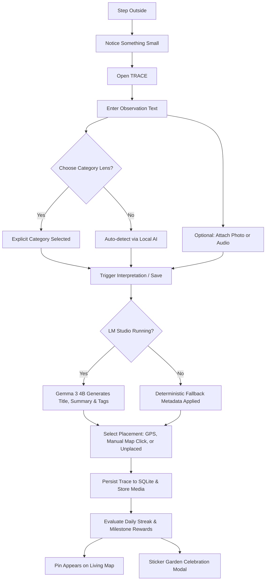
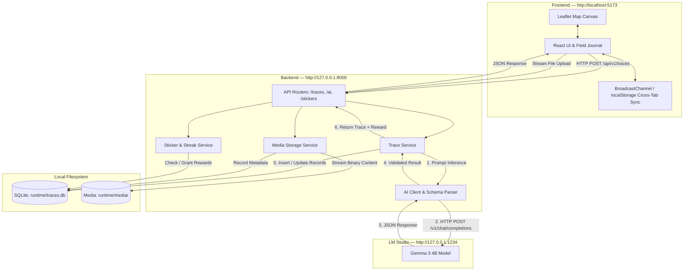

# TRACE

> **Go outside. Notice more. Leave a trace.**

TRACE is an open-source, local-first physical exploration system that turns real-world observations into a living personal map. Instead of competing for attention with infinite feeds or gamified chores, TRACE treats the physical world as the primary interface: you step outside, observe something noteworthy, record it as a *trace*, and let local AI help you understand connections across your environment over time.

Every trace—whether a patch of wall moss, an echo under a stone bridge, or an unmapped alleyway—is preserved strictly on your local device with SQLite. If you run a local language model through [LM Studio](https://lmstudio.ai/), TRACE interprets observations with open-weight intelligence (such as Google Gemma 3 4B) without sending notes, photos, voice notes, or coordinates to third-party cloud APIs. When local AI is offline, TRACE continues working seamlessly with deterministic fallbacks.

---

## Table of Contents

- [What Is TRACE?](#what-is-trace)
  - [The Philosophy](#the-philosophy)
  - [How TRACE Differs from Other Tools](#how-trace-differs-from-other-tools)
- [Features](#features)
  - [Explore and Map](#explore-and-map)
  - [Capture and Remember](#capture-and-remember)
  - [Local AI Interpretation](#local-ai-interpretation)
  - [Sticker Garden and Rewards](#sticker-garden-and-rewards)
- [The TRACE Experience: How It Works](#the-trace-experience-how-it-works)
- [Screenshots and Interface](#screenshots-and-interface)
- [Technology Stack](#technology-stack)
- [Architecture: How Everything Connects](#architecture-how-everything-connects)
  - [System Flow Diagram](#system-flow-diagram)
  - [End-to-End Trace Lifecycle](#end-to-end-trace-lifecycle)
- [Prerequisites](#prerequisites)
- [Installation and Local Setup](#installation-and-local-setup)
  - [Stage 1: Obtain the Project](#stage-1-obtain-the-project)
  - [Stage 2: Configure the Backend](#stage-2-configure-the-backend)
  - [Stage 3: Configure the Frontend](#stage-3-configure-the-frontend)
  - [Stage 4: Configure Local AI (Optional)](#stage-4-configure-local-ai-optional)
  - [Stage 5: Run the Application](#stage-5-run-the-application)
  - [Stage 6: Verify Installation](#stage-6-verify-installation)
- [Configuration Reference](#configuration-reference)
- [How to Use TRACE](#how-to-use-trace)
- [Local AI Explained](#local-ai-explained)
- [Data Storage and Privacy](#data-storage-and-privacy)
- [Project Structure](#project-structure)
- [API Reference](#api-reference)
  - [Core Endpoints](#core-endpoints)
  - [Interactive Documentation](#interactive-documentation)
- [Testing and Quality Checks](#testing-and-quality-checks)
- [Troubleshooting](#troubleshooting)
- [Known Limitations](#known-limitations)
- [Contributing](#contributing)
- [Possible Future Directions](#possible-future-directions)
- [License](#license)
- [Acknowledgements and Closing](#acknowledgements-and-closing)

---

## What Is TRACE?

### The Philosophy

Most modern digital products compete to capture your attention and keep you anchored to a screen. Social apps optimize for scroll time, navigation tools optimize for the fastest route between points A and B, and hiking trackers reduce nature to calorie counts and heart rate zones.

TRACE operates on an inverse principle:

> **The world is the interface. The screen should start and end the experience, not become the experience.**

TRACE acts as a digital field notebook for noticing the overlooked details of your physical surroundings:
- Wild mint pushing through a sidewalk crack.
- The reverberating acoustic rhythm of water flowing through an underground culvert.
- A faded surveyor mark chiseled into Victorian masonry.
- A pocket park you pass every morning without truly seeing.

Capturing these moments creates an enduring record of where you paid attention, helping you build a deeper, more attentive relationship with your neighborhood.

### How TRACE Differs from Other Tools

| Dimension | Standard Maps & GPS | Fitness & Hiking Apps | Note & Journal Apps | TRACE |
| :--- | :--- | :--- | :--- | :--- |
| **Primary Goal** | Route navigation and commercial listings | Workout statistics, pacing, and elevation | General document and note storage | Attentive physical exploration and sensory awareness |
| **Core Artifact** | Turn-by-turn directions | GPS polyline breadcrumbs | Plain text or rich text files | Categorized, interpreted field traces on a living canvas |
| **AI Integration** | Cloud recommendation feeds | Performance analytics algorithms | Cloud LLM text editing | Local, offline inference via LM Studio (zero cloud leakage) |
| **Privacy Model** | Cloud-synced user tracking | Cloud activity feeds | Varies (often cloud-synced) | 100% local SQLite database and local media storage |
| **Incentive** | Commercial discovery | Gamified competition & leaderboards | Productivity streaks | Whimsical field stickers, sensory curiosity, and self-paced streaks |

---

## Features

### Explore and Map

- **Living Trace Map**: An interactive, responsive cartographic canvas powered by Leaflet that renders your physical discoveries as distinct illustrated field pins.
- **Five Discovery Categories**: Every trace belongs to one of five core categories, each with its own visual style and icon:
  - 🌿 **Nature**: Living, growing, or changing natural occurrences (flora, moss, birds, weather).
  - 🔊 **Sound**: Acoustic discoveries (birdsong, echoes, flowing water, mechanical rhythms).
  - 🏛️ **Structure**: Built, arranged, engineered, or architectural elements (old walls, bridges, drains, infrastructure).
  - 🔎 **Mystery**: Strange, unexplained, out-of-place, or curious artifacts.
  - 💙 **Personal**: Meaningful personal memories, quiet retreats, and reflections.
- **Category Filter Bar**: Filter your map view instantly across categories with live count badges showing total discoveries.
- **Dual Location Modes**:
  - **GPS Placement**: Uses browser geolocation to anchor your trace directly to where you stand.
  - **Manual Placement**: Click any point on the map to place a trace exactly where you spotted it.
  - **Unplaced Traces**: Save field notes without map coordinates; they remain accessible in your collection and memory log.
- **Trace Detail Cards**: Inspect any trace to view its title, sensory modality, observation text, local AI synthesis, tags, and attached media.
- **Memory Log**: A chronological timeline view of all logged traces with sensory indicators and quick navigation.

### Capture and Remember

- **Observation Capture**: A distraction-free field entry interface designed to quickly jot down observations.
- **Category Selection Precedence**: Users can explicitly choose a category lens (Nature, Sound, Structure, Mystery, Personal) or leave it unselected to let the local AI automatically categorize the discovery. Explicit choices are strictly authoritative and are never silently overwritten.
- **Media Attachments**:
  - **Photos**: Attach field photographs (JPEG, PNG, WebP, GIF) with live preview and client-side validation.
  - **Audio Recordings**: Attach field audio clips (MP3, WAV, OGG, WebM, AAC, FLAC) with an integrated in-browser audio player.
  - **Magic-Byte Sniffing**: The backend verifies file signatures directly rather than trusting client-provided file extensions.
  - **Safety Boundaries**: Strict sandboxing prevents path traversal, and uploads are capped at 15 MB per file.
- **Safe Trace Deletion**: Remove traces with a two-step confirmation dialog that automatically cleans up all associated media files from disk.

### Local AI Interpretation

- **Zero Cloud AI Dependency**: Connects to [LM Studio](https://lmstudio.ai/) running locally on your machine via standard OpenAI-compatible endpoints (`http://127.0.0.1:1234/v1`).
- **Gemma 3 4B Optimization**: Specifically tuned to work with Google's open-weight `google/gemma-3-4b` model.
- **Structured JSON Synthesis**: Transforms raw, unstructured observation notes into structured metadata:
  - Title generation (concise, poetic, field-appropriate).
  - Qualitative summary.
  - Thematic tags.
  - Sensory modality classification (`visual`, `auditory`, `olfactory`, `tactile`, `kinesthetic`).
  - Classification confidence score.
- **Resilient Fallbacks**: If LM Studio is paused or not running, TRACE creates traces without disruption, gracefully generating fallback titles and preserving user inputs.

### Sticker Garden and Rewards

- **Exploration Streak System**: Tracks consecutive days of physical exploration. Logging at least one trace on a calendar day qualifies that day.
- **Daily Sticker Claims**: The first qualifying trace of each local day unlocks a charming illustrated sticker from the catalogue.
- **Safe Streak Mechanics**:
  - If you miss a day, your current streak resets to 1 upon your next trace, but your **longest streak** record is preserved forever.
  - Owned stickers and unlocked milestone packs are permanent and are never revoked.
- **Milestone Reward Packs**:
  - 🌿 **The Little Things Club** (7-day streak)
  - 📖 **The Field Journal Collection** (30-day streak)
  - 🐌 **The Outside-ish Personality Pack** (50-day streak)
  - 🗺️ **The World Noticed Collection** (100-day streak)
- **Sticker Collection View**: A responsive, 1:1 square grid layout showcasing collected field stamps and illustrations with rarity badges (Common, Rare, Extraordinary).
- **Interactive Specimen Details**: Click any collected sticker to open a vintage specimen card with its name, quote, rarity, unlock date, and a **Download PNG** button for available artwork.
- **Cross-Tab Synchronization**: Real-time cross-tab updates via `BroadcastChannel` and `localStorage` ensure that saving a trace in one browser tab instantly refreshes your streak banner and sticker collection in all other open tabs without a manual page reload.

---

## The TRACE Experience: How It Works



1. **Step Outside**: Take a walk around your block, a city park, or a path you have traveled dozens of times.
2. **Notice a Detail**: Shift focus from your screen to the physical world. Look for textures, masonry details, unusual shadows, bird calls, or street fixtures.
3. **Draft a Trace**: Open TRACE on your local browser. Enter a brief description of what caught your eye.
4. **Choose a Lens or Let AI Decide**: Pick **Sound** for a bird call, **Nature** for ivy, or let the AI categorize it automatically. Attach a field photo or audio clip if you recorded one.
5. **Position the Discovery**: Use your browser's GPS position, drop a manual pin on the map, or keep it unplaced.
6. **Review the Synthesis**: View your observation summarized in field-journal aesthetic with sensory tags.
7. **Grow Your Sticker Garden**: If it is your first trace today, claim a new sticker reward, inspect its card, and watch your exploration streak grow.

---

## Screenshots and Interface

TRACE is styled as an illustrated field notebook with a warm cream and parchment palette, sage-green borders, and vintage typography (`Fraunces` serif headings and `Inter` body text).

To keep this repository lean and focused on code, pre-rendered binary screenshot galleries are omitted. Once you run the quickstart steps below, you will see:
1. **Interactive Trace Map**: Leaflet view centered on your traces with category markers.
2. **Field Capture Card**: Observation textarea with category chips, media preview bars, and AI synthesis cards.
3. **Memory Log**: A compact chronologic list of discoveries.
4. **Sticker Garden**: A specimen cabinet displaying earned stamps, milestone progress bars, and high-resolution sticker modals.

---

## Technology Stack

| Layer | Technology | Purpose in TRACE |
| :--- | :--- | :--- |
| **Frontend Framework** | [React 18](https://react.dev/) | Component architecture, state management, and modal lifecycle |
| **Language (Frontend)** | [TypeScript 5](https://www.typescriptlang.org/) | Strict type contracts shared with backend schemas |
| **Build Tooling** | [Vite 5](https://vitejs.dev/) | Lightning-fast development server and optimized ESM production bundler |
| **Mapping Engine** | [Leaflet](https://leafletjs.com/) & [React-Leaflet](https://react-leaflet.js.org/) | Interactive local cartography, custom SVG marker pins, tile rendering |
| **Styling** | Vanilla CSS3 | Custom design system using CSS custom properties (no bulky utility frameworks) |
| **Backend Framework** | [FastAPI](https://fastapi.tiangolo.com/) (Python 3.11+) | Async REST API, OpenAPI docs, dependency injection |
| **Data Validation** | [Pydantic v2](https://docs.pydantic.dev/) & Pydantic Settings | Strict payload validation, schema serialization, environment parsing |
| **ASGI Server** | [Uvicorn](https://www.uvicorn.org/) | High-performance asynchronous HTTP server |
| **Database** | [SQLite 3](https://www.sqlite.org/) | Zero-configuration local relational database using WAL mode and Foreign Keys |
| **Media Storage** | Local Filesystem | Sandboxed, streaming photo/audio storage with magic-byte verification |
| **Local AI Provider** | [LM Studio](https://lmstudio.ai/) | Local OpenAI-compatible server running open-weight LLMs |
| **Recommended Model**| [Google Gemma 3 4B](https://huggingface.co/google/gemma-3-4b-it) | Fast, high-accuracy qualitative categorization and summary extraction |
| **Testing** | [Pytest](https://pytest.org/) & [HTTPX](https://www.python-httpx.org/) | Comprehensive integration, streak, and regression testing suite |

---

## Architecture: How Everything Connects

### System Flow Diagram



### End-to-End Trace Lifecycle

1. **User Capture**: The user enters an observation in the frontend, selects an optional category lens, and attaches a photo or voice note.
2. **Frontend Dispatch**: The frontend calls `POST /api/v1/traces` with the observation text, category, location coordinates, and placement mode.
3. **Backend Processing**:
   - The FastAPI backend validates inputs with Pydantic (`TraceCreate`).
   - The trace is immediately saved into SQLite with initial metadata.
   - If LM Studio is reachable, the backend queries `google/gemma-3-4b` via `POST /v1/chat/completions` with a strict JSON schema prompt.
   - **Precedence Enforcement**: If the user selected a category, it is preserved. If not, the AI's predicted category is applied.
   - The AI-generated title, summary, and sensory tags update the SQLite trace record.
4. **Streak & Reward Evaluation**:
   - The backend checks if today already contains a qualifying trace.
   - If it is the user's first trace today, `evaluate_rewards()` computes the active streak and awards a new daily sticker from the catalogue.
   - Any completed milestone thresholds (7, 30, 50, or 100 days) unlock their respective packs.
5. **Attachment Streaming**: If media was selected, the frontend uploads files to `POST /api/v1/traces/{id}/attachments`. The backend verifies magic bytes, streams files to disk, and links them to the trace.
6. **Client Refresh**: The response returns the completed trace and reward data. The pin is rendered on the map, the celebration modal opens if a sticker was earned, and a cross-tab event notifies all other open windows.

---

## Prerequisites

| Requirement | Supported Version | Notes |
| :--- | :--- | :--- |
| **Operating System** | Windows 10/11, macOS 12+, or Linux | Commands below are optimized for Windows PowerShell and Bash |
| **Node.js & npm** | Node.js v20.x or higher, npm v10.x+ | Required for frontend build and development server |
| **Python** | Python 3.11, 3.12, or 3.13 | Required for backend FastAPI runtime and SQLite drivers |
| **LM Studio** *(Optional)* | v0.3.0 or higher | Optional local inference runner; TRACE works without it |
| **Local Model** *(Optional)* | `google/gemma-3-4b` (GGUF) | Recommended model for qualitative observation synthesis |
| **Disk Space** | ~500 MB (app only) / ~4 GB (with Gemma 3 4B) | App dependencies require minimal space; local LLMs require 3-5 GB |

---

## Installation and Local Setup

Follow these step-by-step instructions. Windows PowerShell is shown first, followed by macOS/Linux equivalents.

### Stage 1: Obtain the Project

Clone the repository and enter the directory:

```powershell
# Windows PowerShell
git clone https://github.com/shiriei/TRACE.git
cd TRACE
```

```bash
# macOS / Linux
git clone https://github.com/shiriei/TRACE.git
cd TRACE
```

### Stage 2: Configure the Backend

1. Navigate to the `backend/` directory:
   ```powershell
   cd backend
   ```

2. Create a virtual environment:
   ```powershell
   # Windows PowerShell
   python -m venv .venv
   .\.venv\Scripts\Activate.ps1
   ```
   ```bash
   # macOS / Linux
   python3 -m venv .venv
   source .venv/bin/activate
   ```

3. Install backend dependencies:
   ```powershell
   pip install -r requirements.txt
   ```

4. Create your local environment configuration file:
   ```powershell
   # Windows PowerShell (from backend/ directory)
   Copy-Item ..\.env.example .env
   ```
   ```bash
   # macOS / Linux (from backend/ directory)
   cp ../.env.example .env
   ```

   *Note: Default values work out-of-the-box for local development. SQLite automatically creates the database file upon initial startup.*

### Stage 3: Configure the Frontend

In a **new terminal window**, navigate to the `frontend/` directory and install dependencies:

```powershell
# Windows PowerShell or macOS/Linux
cd frontend
npm install
```

### Stage 4: Configure Local AI (Optional)

You can use TRACE completely without local AI; it will use graceful fallback metadata. To enable local Gemma 3 4B intelligence:

1. Download and install [LM Studio](https://lmstudio.ai/).
2. Open LM Studio and search for **Gemma 3 4B** (e.g., `google/gemma-3-4b-it` GGUF).
3. Download the model (Q4_K_M or Q6_K quantization recommended).
4. Go to the **Developer / Local Server** tab in LM Studio (`<->` icon).
5. Load the downloaded Gemma 3 4B model.
6. Verify the server settings:
   - **Port**: `1234`
   - **CORS**: Enabled
7. Click **Start Server**. The local API will be reachable at `http://127.0.0.1:1234/v1`.

### Stage 5: Run the Application

You will run the backend and frontend in two separate terminals.

**Terminal 1 — Backend API Server:**
```powershell
# From the backend/ directory with .venv active
uvicorn app.main:app --host 127.0.0.1 --port 8000 --reload
```
*The backend API will start at: [http://127.0.0.1:8000](http://127.0.0.1:8000)*

**Terminal 2 — Frontend Development Server:**
```powershell
# From the frontend/ directory
npm run dev
```
*The Vite frontend will start at: [http://localhost:5173](http://localhost:5173)*

### Stage 6: Verify Installation

Open your browser and verify the following:

1. **Backend Health**: Visit [http://127.0.0.1:8000/api/v1/health](http://127.0.0.1:8000/api/v1/health). You should see:
   ```json
   {"status":"healthy","project":"TRACE","version":"0.2.0","environment":"development"}
   ```
2. **Interactive API Docs**: Visit [http://127.0.0.1:8000/docs](http://127.0.0.1:8000/docs) to confirm Swagger UI loads.
3. **Frontend Application**: Open [http://localhost:5173](http://localhost:5173). The living map, capture form, and status header should appear.
4. **Create a Test Trace**:
   - In the "Your street has stories" section, enter: `Wild ivy climbing an old brick chimney.`
   - Select the 🌿 **Nature** category lens.
   - Click **Leave a trace** or **Place trace without AI**.
   - Choose **Save as Unplaced Trace**.
   - Verify that the trace is saved, your streak updates to 1, and your first daily sticker is awarded!

---

## Configuration Reference

TRACE reads configuration settings from environment variables or a `.env` file located in the working directory. Below is the complete reference of verified settings:

| Variable Name | Default Value | Required? | Purpose & When to Change |
| :--- | :--- | :--- | :--- |
| `TRACE_HOST` | `127.0.0.1` | No | Host interface for the FastAPI server. Set to `0.0.0.0` to expose on a local LAN. |
| `TRACE_PORT` | `8000` | No | Port for the backend API. Change if port 8000 is occupied by another process. |
| `TRACE_ENVIRONMENT` | `development` | No | Runtime mode string (`development`, `production`, `test`). |
| `TRACE_CORS_ORIGINS` | `http://localhost:5173,http://127.0.0.1:5173` | No | Comma-separated list of browser origins permitted to contact the API. |
| `LM_STUDIO_BASE_URL` | `http://127.0.0.1:1234/v1` | No | OpenAI-compatible endpoint URL for LM Studio. Change if LM Studio runs on another port or machine. |
| `LM_STUDIO_MODEL` | `google/gemma-3-4b` | No | Model identifier expected by LM Studio. Change if you load a different model identifier. |
| `LM_STUDIO_API_KEY` | `lm-studio` | No | Placeholder key required by OpenAI-compatible client libraries (no paid key needed). |
| `LM_STUDIO_TIMEOUT_SECONDS` | `30.0` | No | Inference timeout in seconds. Increase on slower hardware or larger quantization weights. |
| `TRACE_DATABASE_PATH` | `runtime/traces.db` | No | Relative or absolute path to the SQLite database file. Automatically created on startup. |
| `TRACE_MEDIA_DIR` | `runtime/media` | No | Directory path where uploaded photos and audio files are stored. |
| `TRACE_MAX_UPLOAD_SIZE_BYTES` | `15728640` (15 MB) | No | Maximum allowed byte size for a single photo or audio file attachment. |

---

## How to Use TRACE

### 1. Navigating the Map
- Use mouse dragging or trackpad gestures to pan across the map canvas.
- Zoom in and out using the `+` / `-` buttons or the scroll wheel.
- Click any marker icon to open its Field Detail card.

### 2. Filtering Traces
- Use the filter bar directly above the map to view traces by lens:
  - **All** (🍃): Displays all discoveries.
  - **Nature** (🌱), **Sound** (〰️), **Structure** (🏛️), **Mystery** (❓), **Personal** (👤).
- Each chip displays the current count of saved traces matching that category.

### 3. Creating a Trace
1. Scroll down to the **"Your street has stories"** capture card (or click one of the *Five ways to leave a trace* cards).
2. **Category Lens (Optional)**: Click a category chip (`Nature`, `Sound`, `Structure`, `Mystery`, `Personal`) to lock your observation to that category. If you prefer the AI to decide, click *Reset to Auto-detect*.
3. **Observation Text**: Write what you observed outside in plain words.
4. **Attachments (Optional)**:
   - Click **Add a photo** to attach a photo.
   - Click **Add audio** to upload a sound recording.
5. Click **Leave a trace**.
6. The AI synthesizes a title, summary, and tags. Click **Place on Map →**.
7. In the placement dialog:
   - Choose **GPS Position** to place at your current location.
   - Choose **Drop Pin on Map** and click the map location.
   - Or click the close icon (`×`) to **Keep Unplaced**.

### 4. Viewing and Deleting Traces
- Click any marker or memory log item to open the Field Note preview.
- To delete a trace, click **Delete trace** at the bottom of the card and confirm. The trace and its media files will be permanently deleted from your local storage.

### 5. Exploring Sticker Garden
- Click the **Stickers** tab in the navigation header.
- View your **Current Streak**, **Longest Streak**, and today's claim status.
- Inspect your **My Collection** grid.
- Click any unlocked sticker card to open its specimen frame, read its quote, and click **Download PNG** to save the artwork to your device.

---

## Local AI Explained

TRACE uses open-weight local AI because exploration notes are deeply personal records of your physical movements.

### Why Local Inference?
- **Zero Data Leakage**: Your thoughts, locations, and observations never leave your device.
- **No Subscriptions or Paid API Keys**: You never need OpenAI, Anthropic, or cloud API tokens.
- **Offline Capable**: Once model weights are downloaded in LM Studio, TRACE operates without an active internet connection (except for fetching external OpenStreetMap tiles).

### How the Model Works in TRACE
When you submit an observation, the backend formats a system prompt specifying the field-journal aesthetic and enforcing strict JSON output conforming to `TraceAIResult`:
```json
{
  "category": "Sound",
  "title": "Chaffinch Call at Twilight",
  "summary": "Clear, rhythmic birdsong echoing from hedge canopy.",
  "tags": ["birds", "twilight", "hedgerow"],
  "sensory_type": "auditory",
  "confidence": 0.92
}
```

### The Category Precedence Rule
To respect the user's intent:
1. If you explicitly pick a category (e.g., **Sound** for a bird call audio note), that category is **authoritative**. The model will not replace it with **Nature**.
2. The AI still generates the title, summary, tags, and sensory modality.
3. If no category is picked, the model's predicted category acts as the automatic fallback.
4. If LM Studio is not running, TRACE falls back gracefully to deterministic titles and saves the trace without error.

---

## Data Storage and Privacy

### What TRACE Stores
- **Trace Records**: Stored in `runtime/traces.db` (SQLite). Includes observation text, title, summary, tags, coordinates, category, sensory type, and timestamps.
- **Media Attachments**: Stored in `runtime/media/` with random UUID filenames.
- **Sticker Ownership & Streaks**: Stored in SQLite tables (`sticker_ownership`, `daily_reward_claims`, `milestone_claims`).

### Privacy Architecture
- **No Remote Databases**: There is no remote database server or user account synchronization.
- **No Third-Party Analytics**: TRACE does not load Google Analytics, tracking pixels, telemetry probes, or session recorders.
- **Map Tile Requests**: The map loads standard OpenStreetMap tiles via Leaflet. If you wish to use TRACE completely offline, Leaflet can be configured with an offline tile server.
- **Safe Cascading Deletions**: Deleting a trace permanently removes its database record and deletes its corresponding media files from the filesystem.

---

## Project Structure

```
TRACE/
├── .env.example             # Configuration template for local settings
├── LICENSE                  # MIT open-source license
├── README.md                # Comprehensive project documentation
├── docs/
│   └── ARCHITECTURE.md      # In-depth architectural specifications
├── backend/
│   ├── requirements.txt     # Python backend dependencies
│   ├── app/
│   │   ├── main.py          # FastAPI application entrypoint & lifespan
│   │   ├── api/
│   │   │   ├── __init__.py  # Root API router mounting versioned endpoints
│   │   │   └── routes/      # Endpoints: /traces, /ai, /attachments, /stickers, /health
│   │   ├── core/
│   │   │   └── config.py    # Pydantic BaseSettings & configuration defaults
│   │   ├── db/
│   │   │   └── database.py  # SQLite connection manager, schema initialization, WAL mode
│   │   ├── models/          # Internal dataclasses & database entities
│   │   ├── schemas/         # Pydantic request & response serialization models
│   │   ├── services/        # Business logic: trace_service, sticker_service, media_storage
│   │   ├── ai/              # LM Studio client, JSON parser, prompts, & error handling
│   │   └── stickers/        # Sticker catalogue definitions and milestone pack metadata
│   └── tests/               # Pytest suite: test_traces, test_stickers, test_attachments, test_ai
└── frontend/
    ├── package.json         # Frontend dependencies and npm scripts
    ├── vite.config.ts       # Vite bundler configuration
    ├── index.html           # HTML entry shell with Google Fonts
    ├── public/
    │   └── assets/stickers/ # Verified transparent PNG sticker illustration assets
    └── src/
        ├── App.tsx          # Root React application shell and cross-tab sync init
        ├── index.css        # Field-journal design system tokens and responsive styles
        ├── types/           # TypeScript domain definitions (Trace, Sticker, Media)
        ├── services/        # API clients (api.ts, traceService.ts, stickerService.ts)
        ├── hooks/           # Custom hooks (useHealthStatus, useStreak)
        └── features/
            ├── map/         # TraceMap, TraceMarker, MapFilterBar, DetailCard, Thumbnails
            ├── ai/          # TraceAIInterpreter creation form and category chips
            └── stickers/    # StickerGardenJourney, StickerDetailModal, DailyRewardModal
```

---

## API Reference

### Core Endpoints

All application routes are prefixed with `/api/v1` (except the root `/` and `/health` probe). Authentication is not required for local use.

| Method | Endpoint | Description | Request Payload | Response |
| :--- | :--- | :--- | :--- | :--- |
| `GET` | `/health` | Server health probe | None | `{"status":"healthy","project":"TRACE",...}` |
| `GET` | `/api/v1/health` | Versioned server health check | None | `HealthResponse` |
| `GET` | `/api/v1/ai/status` | Probes local LM Studio reachability | None | `{"available": bool, "model": str, ...}` |
| `POST`| `/api/v1/ai/interpret-trace` | Synthesize an observation via local AI | `{"observation": str}` | `TraceAIResult` |
| `POST`| `/api/v1/traces` | Create and persist a new field trace | `TraceCreate` JSON | `TraceResponse` (201 Created) |
| `GET` | `/api/v1/traces` | List recorded traces (optional category query) | `?category=Nature&limit=100` | `List[TraceResponse]` |
| `GET` | `/api/v1/traces/{id}` | Retrieve a specific trace by ID | None | `TraceResponse` |
| `DELETE`| `/api/v1/traces/{id}` | Delete a trace and its attached media | None | `{"message":"...","id": str}` |
| `POST`| `/api/v1/traces/{id}/attachments` | Upload a photo or audio attachment | `multipart/form-data` | `AttachmentResponse` (201 Created) |
| `GET` | `/api/v1/traces/{id}/attachments` | List all attachments for a trace | None | `List[AttachmentResponse]` |
| `GET` | `/api/v1/traces/{id}/attachments/{att_id}/content` | Stream binary media file | None | Binary audio/image stream |
| `DELETE`| `/api/v1/traces/{id}/attachments/{att_id}` | Delete specific media attachment | None | `{"message":"...","id": str}` |
| `GET` | `/api/v1/stickers` | Retrieve sticker catalogue | `?theme=botanical` | `List[StickerResponse]` |
| `GET` | `/api/v1/stickers/packs` | List reward milestone packs | None | `List[StickerPackResponse]` |
| `GET` | `/api/v1/stickers/collection` | List earned sticker collection | None | `List[OwnedStickerResponse]` |
| `GET` | `/api/v1/stickers/streak` | Read-only streak & qualifying status | `?tz_offset_minutes=...` | `StreakSummaryResponse` |
| `POST`| `/api/v1/stickers/streak/evaluate` | Evaluate rewards and claim stickers | `?tz_offset_minutes=...` | `StreakEvaluationResult` |
| `GET` | `/api/v1/stickers/{id}` | Get metadata for a specific sticker | None | `StickerResponse` |

### Interactive Documentation
With the backend server running, open [http://127.0.0.1:8000/docs](http://127.0.0.1:8000/docs) in your browser to explore the interactive OpenAPI (Swagger) interface, test requests, and view complete JSON schema models.

---

## Testing and Quality Checks

TRACE maintains rigorous test coverage across persistence, streak evaluation, attachments, and AI fallback behavior.

### Running Backend Tests
Activate the Python virtual environment and run the Pytest suite:
```powershell
# From the backend/ directory
.\.venv\Scripts\pytest.exe -v
```
*(All 103 integration and regression tests verify trace creation, audio/photo uploads, streak progression, read-only summaries, and category precedence).*

### Running Frontend Type Checking
Verify strict TypeScript compilation without emitting files:
```powershell
# From the frontend/ directory
npm run typecheck
```

### Running Frontend Production Build
Validate production bundling and asset resolution:
```powershell
# From the frontend/ directory
npm run build
```

---

## Troubleshooting

| What You See | Likely Cause | Safe Diagnostic / Resolution Steps |
| :--- | :--- | :--- |
| **`Local AI unavailable` badge in creation card** | LM Studio is not running, or server is paused on port 1234. | 1. Open LM Studio.<br>2. Go to the Local Server tab (`<->`).<br>3. Ensure a model is loaded and click **Start Server**.<br>4. *Note: You can still click "Place trace without AI" to save traces normally.* |
| **`TRACE AI took too long to respond`** | Inference timed out (default 30 seconds). | Increase `LM_STUDIO_TIMEOUT_SECONDS=60.0` in your backend `.env` file, or select a smaller model quantization. |
| **`uvicorn: error: [Errno 10048] address already in use`** | Another process is using port 8000. | Stop the existing server or run on another port: `uvicorn app.main:app --port 8001 --reload` (update `VITE_API_BASE_URL` if configured). |
| **`Vite: Port 5173 is in use`** | Another Vite or web dev server is open. | Vite will automatically offer port 5174. Accept or terminate the conflicting terminal. |
| **`File is empty or too small to verify content type` (415)** | Uploaded file failed magic-byte verification or is corrupt. | Ensure the file is a genuine JPEG, PNG, WebP, GIF, MP3, WAV, OGG, WebM, or AAC file. |
| **`File exceeds maximum allowed upload size` (413)** | The media attachment is larger than 15 MB. | Compress the image or audio file, or raise `TRACE_MAX_UPLOAD_SIZE_BYTES` in `.env`. |
| **Browser geolocation prompt denied** | Geolocation permission blocked in browser settings. | Use **Drop Pin on Map** (manual placement) or **Keep Unplaced**, or reset location permissions in browser site settings. |
| **Sticker artwork shows stamp placeholder** | The specific sticker does not yet have a physical PNG artwork file. | This is expected design fallback. Stickers without dedicated artwork render a charming field stamp placeholder until artwork is illustrated. |

---

## Known Limitations

- **Sticker Artwork Coverage**: High-resolution botanical and creature illustrations are currently bundled for `Tiny Sprout`, `Rock Lichen`, and `Unscheduled Snail`. Other catalogue items display the field-journal stamp fallback until additional artwork is created.
- **Local Model Constraints**: Quality of AI titles and summaries depends directly on the model running in LM Studio. We recommend `google/gemma-3-4b` for the best balance of speed and poetic observation synthesis.
- **Cartographic Internet Requirement**: While trace data, media, and AI inference run 100% locally and offline, the underlying map canvas fetches OpenStreetMap tiles from public tile servers when connected to the internet.
- **Single-User Architecture**: TRACE is built as a personal field journal. Multi-user accounts, social feeds, and cloud sync are intentionally not part of the design.

---

## Contributing

We welcome contributions from developers, technical writers, botanical enthusiasts, and designers who share our love for the physical world!

To contribute:
1. **Fork the Repository**: Create a personal fork of `shiriei/TRACE`.
2. **Clone Your Fork**:
   ```bash
   git clone https://github.com/<your-username>/TRACE.git
   cd TRACE
   ```
3. **Create a Topic Branch**:
   ```bash
   git checkout -b feature/sensory-audio-visualizer
   ```
4. **Make Focused Changes**: Keep changes aligned with the field-journal aesthetic and local-first architecture.
5. **Run the Verification Suite**:
   ```bash
   # Backend
   cd backend && pytest -v
   # Frontend
   cd ../frontend && npm run typecheck && npm run build
   ```
6. **Submit a Pull Request**: Provide a clear explanation of what was added or fixed and how you verified your changes.

---

## Possible Future Directions

The following exploratory concepts reflect possible future enhancements for TRACE:
- **Spatial Territory Frontiers**: Visualizing unexplored zones and pockets in your neighborhood where you have not yet left a trace.
- **Adaptive Exploration Cues**: Suggesting subtle, curiosity-driven prompts for your next walk based on patterns in your past traces (e.g., *"You notice masonry often. What sounds live near the brickwork?"*).
- **Offline Map Tile Caching**: Built-in caching of local map tiles to enable fully offline cartography in remote areas.
- **Expanded Catalogue Artwork**: Additional illustrated sticker rewards celebrating attentive field discovery.

---

## License

TRACE is open-source software licensed under the **[MIT License](LICENSE)**.

```
Copyright (c) 2026 TRACE Contributors
```

You are free to use, study, modify, and distribute this software in accordance with the terms of the MIT license.

---

## Acknowledgements and Closing

TRACE was created for anyone who has ever walked past an old tree, an overgrown alley, or an echo beneath a bridge and thought: *I want to remember that this was here.*

Put your phone in your pocket. Go outside. Notice more. Leave a trace.
