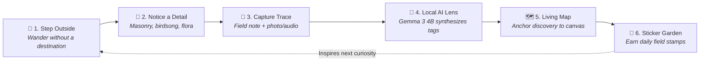
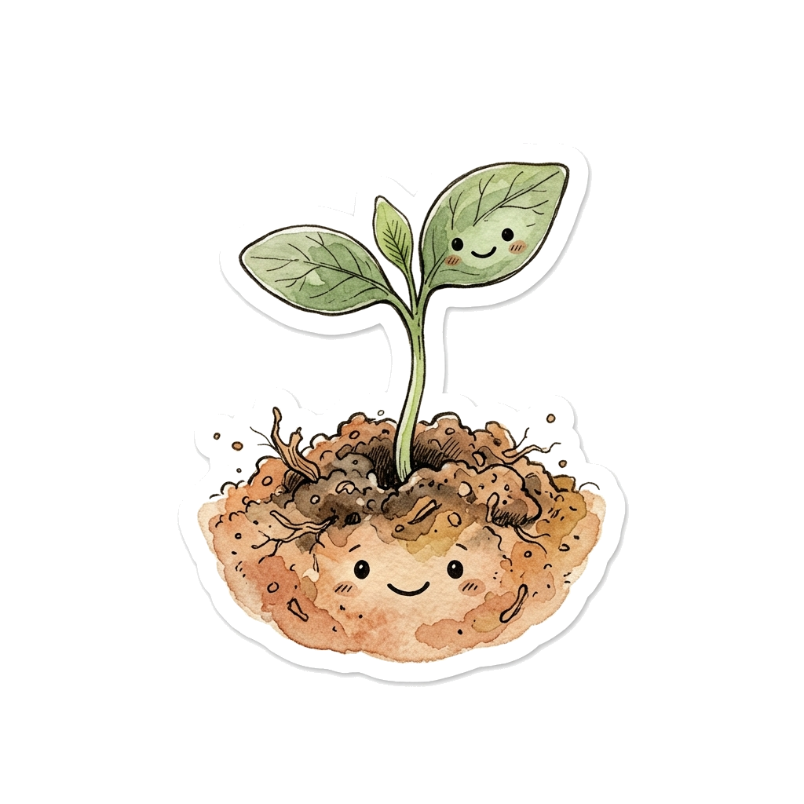
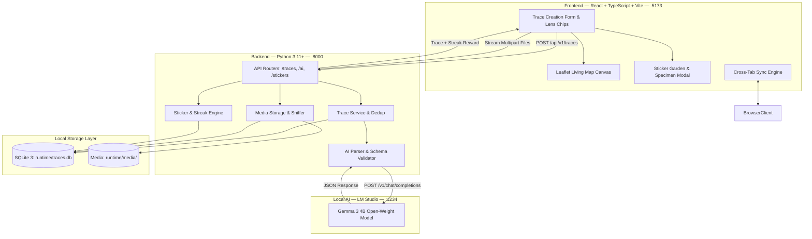
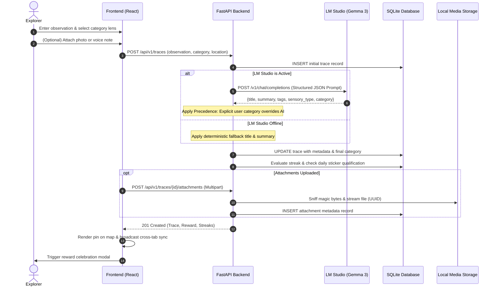

<div align="center">

  

  # TRACE

  ### **Go outside. Notice more. Leave a trace.**

  *A local-first physical exploration system and illustrated digital field journal.*<br>
  *Capture small real-world discoveries, build a living personal map, and uncover patterns through local AI.*

  <br>

  [](LICENSE)
  [](backend/)
  [](backend/)
  [](frontend/)
  [](frontend/)
  [](frontend/)
  [](backend/app/db/database.py)
  [](https://lmstudio.ai/)

  <br>

  [**Discover TRACE**](#discover-trace) &nbsp;•&nbsp;
  [**The Core Loop**](#the-core-loop) &nbsp;•&nbsp;
  [**Explore the Experience**](#explore-the-experience) &nbsp;•&nbsp;
  [**Quick Start**](#quick-start) &nbsp;•&nbsp;
  [**System Architecture**](#system-architecture) &nbsp;•&nbsp;
  [**Reference & Docs**](#developer-reference--deep-dives) &nbsp;•&nbsp;
  [**Contributing**](#contributing)

</div>

<br>

---

## Discover TRACE

Most modern digital tools compete fiercely for your screen time. Social algorithms optimize for passive scrolling, fitness apps reduce the outdoors to calorie counts and heart rate zones, and navigation systems rush you along the fastest highway between two points.

TRACE is built on an inverse philosophy:

> **The world is the interface. The screen should start and end the experience, not become the experience.**

When you step out into your neighborhood or wander an unfamiliar street, the physical world is filled with quiet, unnoticed details:
- Wild chamomile blossoming through a curb seam.
- The distinct acoustic rhythm of water echoing down an underground culvert.
- A faded mason's crest chiseled into a 19th-century lintel.
- An unexpected dirt trail cutting between two brick cul-de-sacs.

TRACE gives you an enduring, private place to record these moments as **traces**. Over time, your discoveries construct an illustrated, living map of where you paid attention. When local AI is enabled via [LM Studio](https://lmstudio.ai/), open-weight models (such as **Google Gemma 3 4B**) synthesize your field notes, uncover hidden sensory patterns, and prompt where you might look next—all without sending a single coordinate, photo, or thought to cloud servers.

---

## Why TRACE Exists

```
┌────────────────────────────────────────────────────────────────────────┐
│  CONVENTIONAL APPS                                                     │
│  [Screen] ──► [Infinite Feed] ──► [Notification Ping] ──► [More Screen]│
│                                                                        │
│  TRACE FIELD JOURNAL                                                   │
│  [Screen: Brief Spark] ──► [Step Outside & Observe] ──► [Living Map]   │
└────────────────────────────────────────────────────────────────────────┘
```

| Dimension | Standard Maps & GPS | Fitness & Hiking Apps | Note & Journal Apps | TRACE Field Journal |
| :--- | :--- | :--- | :--- | :--- |
| **Primary Focus** | Turn-by-turn routing & commercial ads | Workout metrics, heart rate, & pacing | Document drafting & productivity | Attentive physical exploration & curiosity |
| **Core Artifact** | Directions & business listings | GPS polyline tracks & split times | Freeform text documents | Categorized, sensory field traces on a living canvas |
| **AI Integration** | Cloud recommendation engines | Cloud performance algorithms | Proprietary cloud LLM rewriting | **100% local inference** via LM Studio (zero cloud leakage) |
| **Data Privacy** | Cloud user accounts & tracking | Public social activity feeds | Cloud sync services | **Strictly local SQLite & filesystem storage** |
| **Incentive** | Commercial consumption | Gamified competitive leaderboards | Productivity streaks | Whimsical field stickers, sensory curiosity, & self-paced streaks |

---

## The Core Loop

The TRACE exploration cycle bridges the digital interface with the living physical world:



1. **Step Outside**: Close the browser, put your phone in your pocket, and explore the physical world at human walking speed.
2. **Notice a Detail**: Shift attention to sensory observations: an unusual sound, an engineered remnant, or an overgrown corner.
3. **Capture a Trace**: Return to TRACE to write what you saw. Optionally pick an explicit category lens and attach a field photo or audio recording.
4. **Local AI Synthesis**: Your local Gemma model generates a concise field title, qualitative summary, and sensory tags. If you chose a category lens, your choice is strictly authoritative.
5. **Living Map Placement**: Anchor the trace using browser GPS, click directly on the map, or keep it unplaced in your memory log.
6. **Sticker Garden & Rewards**: If this is your first trace today, claim an illustrated field sticker, build your exploration streak, and unlock milestone packs.

---

## Explore the Experience

### The Living Trace Map
*Your physical discoveries, rendered as an illustrated cartographic canvas.*

* **Leaflet Spatial Canvas**: Interactive, fluid map rendering customized with TRACE's vintage parchment aesthetic.
* **Five Distinct Discovery Lenses**:
  - 🌿 **Nature**: Plants, moss, fungi, wildlife, weather phenomena, and natural cycles.
  - 🔊 **Sound**: Bird calls, stream currents, industrial hums, acoustic echoes, and rhythms.
  - 🏛️ **Structure**: Bridges, old masonry, culverts, street furniture, and infrastructure.
  - 🔎 **Mystery**: Unexplained markings, out-of-place objects, and historical puzzles.
  - 💙 **Personal**: Meaningful spots, quiet benches, memories, and personal sanctuaries.
* **Category Filter Bar**: Filter by lens with single-click filter chips showing live counters of total discoveries.
* **Flexible Placement**: Drop markers via high-accuracy **GPS**, click anywhere for **Manual Placement**, or save notes as **Unplaced Traces**.

### Capture What You Notice
*A focused field-journal entry tool engineered for rapid, tactile recording.*

* **Distraction-Free Field Notes**: Simple text area designed for natural, evocative field descriptions.
* **Category Precedence Rule**: Choose an explicit category lens, or leave it unselected to let local AI auto-classify. User choices are **authoritative** and are never silently overwritten.
* **Photo & Audio Attachments**:
  - **Photographs**: JPEG, PNG, WebP, GIF with instant client-side thumbnail previews.
  - **Audio Recordings**: MP3, WAV, OGG, WebM, AAC, FLAC with an embedded in-browser audio player.
  - **Magic-Byte Sniffing**: Backend inspection verifies true file signatures rather than trusting client extensions.
  - **Safety Boundaries**: Strict filesystem sandboxing prevents path traversal, capped at 15 MB per file.
* **Safe Cascading Deletions**: Deleting a trace from your field notes permanently removes its record and cleanly purges associated media files from disk.

### Local AI, on Your Machine
*Open-weight intelligence running privately on your own hardware via LM Studio.*

* **Zero Cloud Dependency**: Runs through [LM Studio](https://lmstudio.ai/) using standard OpenAI-compatible endpoints (`http://127.0.0.1:1234/v1`).
* **Optimized for Google Gemma 3 4B**: Tuned system prompts extract structured JSON (`title`, `summary`, `tags`, `sensory_type`, `confidence`).
* **Deterministic Fallbacks**: If LM Studio is paused or uninstalled, TRACE works without interruption, applying smart fallback titles and preserving full note fidelity.
* **Absolute Privacy**: Coordinates, journal entries, and media files are never transmitted to external cloud AI providers.

### The Sticker Garden
*Cute is the aesthetic. Exploration is the purpose. Stickers are the reward.*

* **Daily Exploration Streaks**: Logging a trace qualifies your calendar day. Streaks encourage slow, regular walks.
* **Resilient Streak Rules**: Missing a day resets the current streak counter, but your **longest streak record is preserved forever**, and earned stickers are never lost.
* **Milestone Collections**:
  - 🌿 **The Little Things Club** (7-day streak)
  - 📖 **The Field Journal Collection** (30-day streak)
  - 🐌 **The Outside-ish Personality Pack** (50-day streak)
  - 🗺️ **The World Noticed Collection** (100-day streak)
* **Specimen Modal & High-Res Downloads**: Inspect any collected card in an archival specimen frame and click **Download PNG** to save transparent sticker artwork to your device.
* **Cross-Tab Synchronization**: Real-time synchronization via `BroadcastChannel` and `localStorage` keeps streak counters and sticker rewards synced across all open browser tabs instantly.

#### Verified Specimen Artwork Showcase

Below is a preview of verified sticker illustrations bundled directly in TRACE:

| Tiny Sprout | Rock Lichen | Unscheduled Snail |
| :---: | :---: | :---: |
|  |  |  |
| *"Look at me, being alive and stuff."* | *"Taking things slow on a warm rock."* | *"Outside. Against my usual schedule."* |
| **Theme**: Botanical &bull; Common | **Theme**: Botanical &bull; Common | **Theme**: Creatures &bull; Common |

*(Stickers whose artwork is currently in illustration display a decorative field-stamp placeholder until transparent PNGs are added).*

---

## Quick Start

Get TRACE running locally in five minutes. Windows PowerShell is shown first, followed by macOS/Linux commands.

### Prerequisites

- **Python**: 3.11, 3.12, or 3.13 installed
- **Node.js**: v20.x or higher + npm
- **Git**: Installed and available in terminal
- **LM Studio** *(Optional)*: Recommended for local Gemma 3 4B AI interpretation

### 1. Clone the Repository

```powershell
# Windows PowerShell & macOS/Linux
git clone https://github.com/shiriei/TRACE.git
cd TRACE
```

### 2. Configure & Run Backend

In your **first terminal window**:

```powershell
# Windows PowerShell
cd backend
python -m venv .venv
.\.venv\Scripts\Activate.ps1
pip install -r requirements.txt
Copy-Item ..\.env.example .env

# Start FastAPI server on port 8000
uvicorn app.main:app --host 127.0.0.1 --port 8000 --reload
```

```bash
# macOS / Linux
cd backend
python3 -m venv .venv
source .venv/bin/activate
pip install -r requirements.txt
cp ../.env.example .env

# Start FastAPI server on port 8000
uvicorn app.main:app --host 127.0.0.1 --port 8000 --reload
```

*The SQLite database (`runtime/traces.db`) initializes automatically on first boot.*

### 3. Configure & Run Frontend

In a **second terminal window**:

```powershell
# Windows PowerShell & macOS/Linux
cd TRACE/frontend
npm install

# Start Vite development server
npm run dev
```

Open your browser to: **[http://localhost:5173](http://localhost:5173)**

### 4. Optional: Enable Local Gemma AI via LM Studio

1. Download and launch [LM Studio](https://lmstudio.ai/).
2. Search for and download **Gemma 3 4B** (e.g. `google/gemma-3-4b-it` GGUF).
3. Click the **Developer / Local Server** tab (`<->` on the left sidebar).
4. Select and load the Gemma 3 4B model into memory.
5. Set port to `1234`, enable **CORS**, and click **Start Server**.
6. TRACE will automatically detect the server and display an active local-AI status indicator.

### 5. Verify Installation Checklist

- [x] **Backend Health**: [http://127.0.0.1:8000/api/v1/health](http://127.0.0.1:8000/api/v1/health) returns `{"status":"healthy"}`.
- [x] **Swagger UI**: [http://127.0.0.1:8000/docs](http://127.0.0.1:8000/docs) loads interactive OpenAPI documentation.
- [x] **Frontend Canvas**: [http://localhost:5173](http://localhost:5173) displays the living map and field capture form.
- [x] **First Trace**: Write an observation, select 🌿 **Nature**, save unplaced, and watch your first sticker unlock!

---

## System Architecture

### Component Hierarchy



### Trace Lifecycle Sequence



---

## Developer Reference & Deep Dives

<details>
<summary><strong>⚙️ Complete Configuration Reference (.env)</strong></summary>

<br>

TRACE loads configuration from environment variables or a `.env` file in the working directory. Below is the verified reference of all configuration options:

| Variable Name | Default Value | Description & Usage |
| :--- | :--- | :--- |
| `TRACE_HOST` | `127.0.0.1` | Network interface for FastAPI server. Use `0.0.0.0` for local network access. |
| `TRACE_PORT` | `8000` | Port for the backend API server. |
| `TRACE_ENVIRONMENT` | `development` | Operating environment (`development`, `production`, `test`). |
| `TRACE_CORS_ORIGINS` | `http://localhost:5173,http://127.0.0.1:5173` | Comma-separated list of browser origins permitted by CORS headers. |
| `LM_STUDIO_BASE_URL` | `http://127.0.0.1:1234/v1` | OpenAI-compatible endpoint URL where LM Studio serves completions. |
| `LM_STUDIO_MODEL` | `google/gemma-3-4b` | Model identifier string loaded into LM Studio. |
| `LM_STUDIO_API_KEY` | `lm-studio` | Placeholder key required by standard OpenAI client libraries. |
| `LM_STUDIO_TIMEOUT_SECONDS`| `30.0` | Maximum seconds to wait for AI model completion before using fallbacks. |
| `TRACE_DATABASE_PATH` | `runtime/traces.db` | Relative or absolute path to SQLite file. Automatically initialized on startup. |
| `TRACE_MEDIA_DIR` | `runtime/media` | Directory where uploaded photos and audio files are stored. |
| `TRACE_MAX_UPLOAD_SIZE_BYTES`| `15728640` (15 MB) | Strict upload ceiling for individual media attachments. |

</details>

<details>
<summary><strong>📡 Complete API Endpoint Reference</strong></summary>

<br>

All endpoints are served under `/api/v1` (except the root `/` and `/health` probe). Full interactive Swagger documentation is available at `http://127.0.0.1:8000/docs`.

### Core Health & Root Routes
* `GET /health` &mdash; Root-level server health probe. Returns `{"status": "healthy", "project": "TRACE", ...}`.
* `GET /` &mdash; Service entrypoint with API metadata and documentation links.
* `GET /api/v1/health` &mdash; Versioned health endpoint matching frontend connection checks.

### Traces API (`/api/v1/traces`)
* `POST /api/v1/traces` &mdash; Create a new trace observation. Triggers AI metadata synthesis and reward evaluation.
* `GET /api/v1/traces` &mdash; List traces with optional `category`, `limit` (max 500), and `offset` pagination.
* `GET /api/v1/traces/{trace_id}` &mdash; Retrieve a specific trace by ID.
* `DELETE /api/v1/traces/{trace_id}` &mdash; Permanently delete a trace and purge all associated attachment files.

### Media Attachments API (`/api/v1/traces/{trace_id}/attachments`)
* `POST /api/v1/traces/{trace_id}/attachments` &mdash; Upload a photo or audio file. Verifies magic bytes and enforces 15 MB limit.
* `GET /api/v1/traces/{trace_id}/attachments` &mdash; List all media attachments associated with a trace.
* `GET /api/v1/traces/{trace_id}/attachments/{attachment_id}` &mdash; Retrieve attachment metadata.
* `GET /api/v1/traces/{trace_id}/attachments/{attachment_id}/content` &mdash; Stream binary file content with correct MIME headers.
* `DELETE /api/v1/traces/{trace_id}/attachments/{attachment_id}` &mdash; Delete an individual attachment file.

### Local AI API (`/api/v1/ai`)
* `GET /api/v1/ai/status` &mdash; Probe reachability of local LM Studio instance without failing backend health.
* `POST /api/v1/ai/interpret-trace` &mdash; Directly classify and extract structured metadata from raw observation text.

### Sticker Garden API (`/api/v1/stickers`)
* `GET /api/v1/stickers` &mdash; Retrieve the full sticker catalogue with dynamic asset-availability flags and optional theme filter.
* `GET /api/v1/stickers/packs` &mdash; List milestone reward pack definitions (7d, 30d, 50d, 100d).
* `GET /api/v1/stickers/collection` &mdash; Retrieve earned stickers owned by the explorer.
* `POST /api/v1/stickers/collection/grant` &mdash; Grant an unlocked catalogue sticker to collection.
* `GET /api/v1/stickers/streak` &mdash; **Read-only** streak summary: current streak, longest streak, today's qualification, and milestone progress.
* `POST /api/v1/stickers/streak/evaluate` &mdash; Explicitly evaluate streak qualification and unlock eligible rewards.
* `GET /api/v1/stickers/{sticker_id}` &mdash; Retrieve metadata for an individual sticker.

</details>

<details>
<summary><strong>📁 Project Structure & File Guide</strong></summary>

<br>

```
TRACE/
├── .env.example             # Configuration template for local overrides
├── LICENSE                  # MIT Open-Source License
├── README.md                # Comprehensive documentation & field guide
├── docs/
│   └── ARCHITECTURE.md      # Detailed system architecture specification
├── backend/
│   ├── requirements.txt     # Python dependencies (FastAPI, Uvicorn, Pydantic, etc.)
│   ├── app/
│   │   ├── main.py          # FastAPI application entrypoint & lifespan manager
│   │   ├── api/
│   │   │   ├── __init__.py  # Root API router mounting versioned routes
│   │   │   └── routes/      # Endpoints: /traces, /ai, /attachments, /stickers, /health
│   │   ├── core/
│   │   │   └── config.py    # Pydantic Settings & environment variable parsing
│   │   ├── db/
│   │   │   └── database.py  # SQLite connection manager, WAL mode, foreign keys
│   │   ├── models/          # Dataclasses & internal domain models
│   │   ├── schemas/         # Pydantic request/response validation schemas
│   │   ├── services/        # Business logic: trace_service, sticker_service, media_storage
│   │   ├── ai/              # LM Studio HTTP client, JSON schema parser, prompts
│   │   └── stickers/        # Sticker catalogue definitions & milestone packs
│   └── tests/               # 103 Pytest tests: test_traces, test_stickers, test_attachments, test_ai
└── frontend/
    ├── package.json         # Frontend dependencies & npm scripts
    ├── vite.config.ts       # Vite bundler configuration
    ├── index.html           # HTML entrypoint loading Fraunces & Inter fonts
    ├── public/
    │   ├── trace-mark.svg   # TRACE vector compass mark
    │   └── assets/stickers/ # Verified transparent PNG sticker illustrations
    └── src/
        ├── App.tsx          # Root application shell & cross-tab sync coordinator
        ├── index.css        # Field-journal design tokens & responsive styles
        ├── types/           # TypeScript interfaces (Trace, Sticker, Media)
        ├── services/        # Frontend API clients (api.ts, traceService.ts, stickerService.ts)
        ├── hooks/           # Custom React hooks (useStreak, useHealthStatus)
        └── features/
            ├── map/         # Living Trace Map, markers, detail card, thumbnails
            ├── ai/          # TraceAIInterpreter creation form & category lens chips
            └── stickers/    # StickerGardenJourney, StickerDetailModal, DailyRewardModal
```

</details>

<details>
<summary><strong>🧪 Test Suite & Quality Verification</strong></summary>

<br>

### Backend Pytest Suite
The backend test suite covers trace persistence, AI failure resiliency, audio/photo uploads, read-only streak summaries, and category precedence rules:
```powershell
# From the backend/ directory with .venv active
.\.venv\Scripts\pytest.exe -v
```
*Current test suite: **103 passed tests** across `test_traces.py`, `test_stickers.py`, `test_attachments.py`, `test_ai.py`, and `test_health.py`.*

### Frontend Type Checking
Verify strict TypeScript compilation across the entire frontend application:
```powershell
# From the frontend/ directory
npm run typecheck
```

### Frontend Production Bundling
Verify asset bundling, tree-shaking, and minification:
```powershell
# From the frontend/ directory
npm run build
```

</details>

<details>
<summary><strong>🔧 Practical Troubleshooting Guide</strong></summary>

<br>

| Symptom | Probable Cause | Diagnostic & Resolution Steps |
| :--- | :--- | :--- |
| **`Local AI unavailable` badge in capture card** | LM Studio is closed or server is stopped on port 1234. | 1. Open LM Studio.<br>2. Navigate to the Local Server tab (`<->`).<br>3. Select Gemma 3 4B and click **Start Server**.<br>4. *TRACE continues functioning normally without AI—simply click "Place trace without AI".* |
| **`TRACE AI took too long to respond` (504)** | Local model inference exceeded timeout. | 1. Increase `LM_STUDIO_TIMEOUT_SECONDS=60.0` in `.env`.<br>2. Select a smaller model quantization (e.g. Q4_K_M) in LM Studio. |
| **`[Errno 10048] address already in use`** | Port 8000 is occupied by another process. | 1. Terminate the conflicting process.<br>2. Or start on another port: `uvicorn app.main:app --port 8001 --reload` (update CORS origins accordingly). |
| **`Port 5173 is in use`** | Another Vite dev server is running. | Vite will automatically suggest port 5174. Accept or terminate the extra server. |
| **`File is empty or too small` (415)** | Uploaded file failed magic-byte header inspection. | Ensure the file is a genuine JPEG, PNG, WebP, GIF, MP3, WAV, OGG, WebM, AAC, or FLAC recording. |
| **`File exceeds maximum upload size` (413)** | Media file exceeds 15 MB. | Compress the recording or raise `TRACE_MAX_UPLOAD_SIZE_BYTES` in backend `.env`. |
| **Browser geolocation prompt denied** | Location access was denied in browser permissions. | Choose **Drop Pin on Map** (manual placement) or **Keep Unplaced**, or reset permissions in browser site settings. |
| **Sticker displays a stamp placeholder** | Artwork for that catalogue sticker is currently in illustration. | This is the intended fallback behavior. Stickers without dedicated PNG artwork render an archival field stamp until illustrations are added. |

</details>

---

## Data Storage and Privacy

TRACE is designed from first principles as a **sovereign, local-first system**:

1. **Local Relational Storage**: All traces, notes, coordinates, sensory types, and timestamps are persisted in `runtime/traces.db` (SQLite). Foreign keys (`ON DELETE CASCADE`) and Write-Ahead Logging (`WAL`) guarantee reliability and clean data integrity.
2. **Local Media Sandboxing**: Uploaded field photographs and audio captures are stored in `runtime/media/` using random UUID filenames.
3. **Zero Telemetry**: TRACE does not include tracking scripts, Google Analytics, telemetry beacons, or advertising SDKs.
4. **Offline Cartography Note**: While observations and AI processing run 100% locally on your machine, the Leaflet map fetches public OpenStreetMap tiles over the internet when connected.
5. **No Cloud Sync or Accounts**: There are no remote user accounts or multi-user cloud synchronization services. Your field notes remain strictly on your computer.

---

## Known Limitations

- **Sticker Artwork Coverage**: High-resolution botanical and creature illustrations are currently bundled for `Tiny Sprout`, `Rock Lichen`, and `Unscheduled Snail`. Other catalogue items display the field-journal stamp fallback until additional artwork is illustrated.
- **Local Model Hardware**: Quality and speed of AI titles, summaries, and tags depend on the computing capacity of your machine. Google Gemma 3 4B is recommended for optimal speed and poetic observation synthesis.
- **Cartographic Tile Fetching**: The Leaflet map engine requires an internet connection to stream OpenStreetMap tiles unless an offline tile server is configured.
- **Single-Explorer Architecture**: TRACE is designed as a personal field notebook. Multi-user accounts, social feeds, and cloud sync are intentionally omitted by design.

---

## Contributing

We warmly welcome contributions from developers, writers, field naturalists, and designers who share our love for noticing the living world!

1. **Fork the Repository**: Create a personal fork of `shiriei/TRACE` on GitHub.
2. **Create a Topic Branch**:
   ```bash
   git checkout -b feature/sensory-audio-visualizer
   ```
3. **Make Focused Changes**: Preserve the vintage field-journal aesthetic, local-first sovereignty, and clean TypeScript/Python types.
4. **Run Verification Commands**:
   ```powershell
   # Backend
   cd backend && pytest -v
   # Frontend
   cd ../frontend && npm run typecheck && npm run build
   ```
5. **Submit a Pull Request**: Detail your changes, testing methodology, and motivations.

---

## Roadmap and Horizons

The following exploratory horizons reflect potential future evolutions for TRACE:
- **Spatial Territory Frontiers**: Visualizing unexplored pockets and alleys in your immediate neighborhood where you have not yet left a trace.
- **Adaptive Curiosity Cues**: Subtle, enigmatic prompts inspired by your personal trace history (e.g., *"You notice old masonry often. What sounds live near the brickwork?"*).
- **Offline Map Tile Caching**: Local tile caching to enable completely disconnected field exploration in remote valleys and forests.
- **Expanded Catalogue Artwork**: Additional hand-illustrated sticker rewards celebrating slow observation.

---

## License

TRACE is open-source software licensed under the **[MIT License](LICENSE)**.

```
Copyright (c) 2026 TRACE Contributors
```

You are free to use, modify, distribute, and study this software in accordance with the terms of the MIT license.

---

## Acknowledgements

TRACE was created for anyone who has ever walked past an old mossy wall, an overgrown alleyway, or an echo beneath a railway bridge and thought:

*I want to remember that this was here.*

<div align="center">

  <br>

  **Put your phone in your pocket. Go outside. Notice more. Leave a trace.**

  <br>

  

</div>
